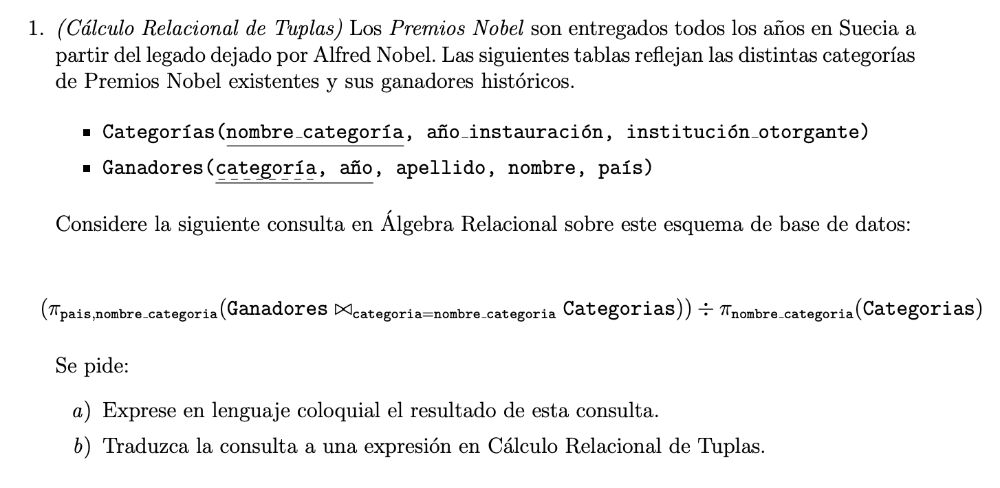
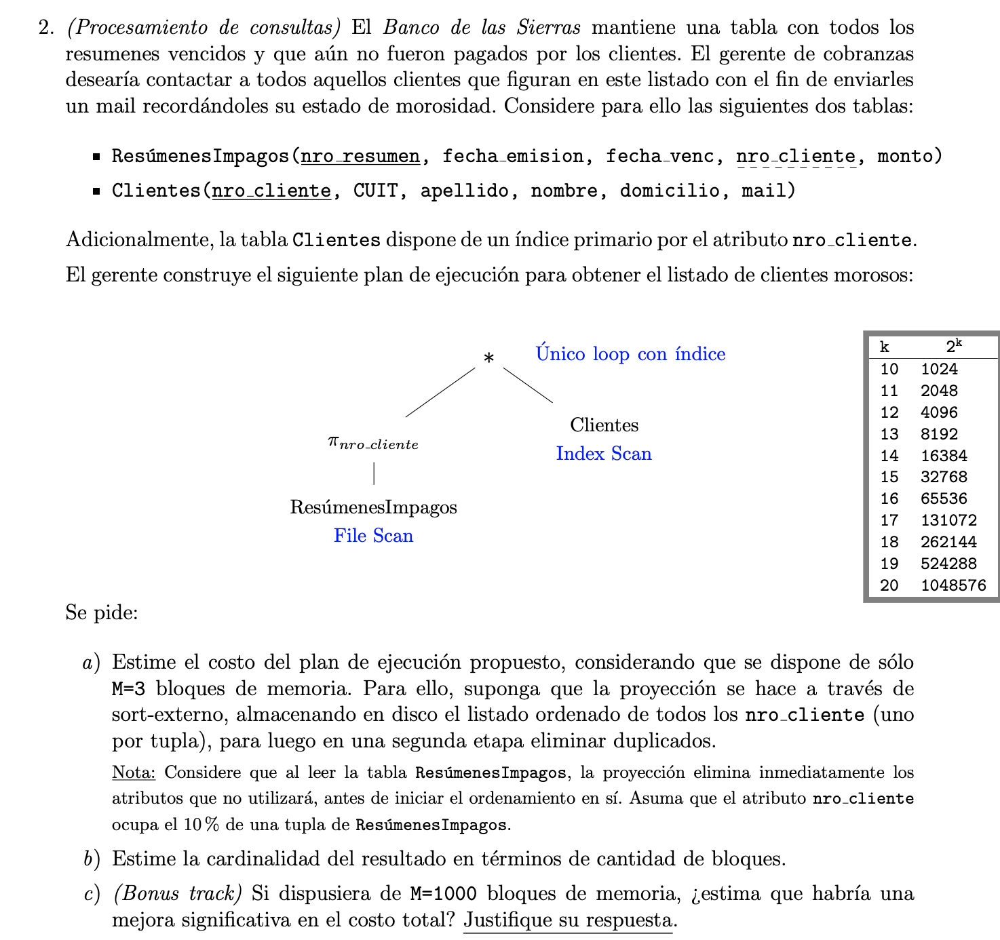
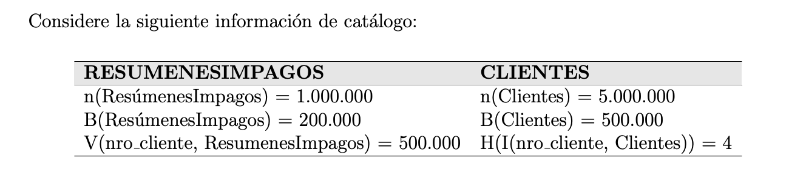
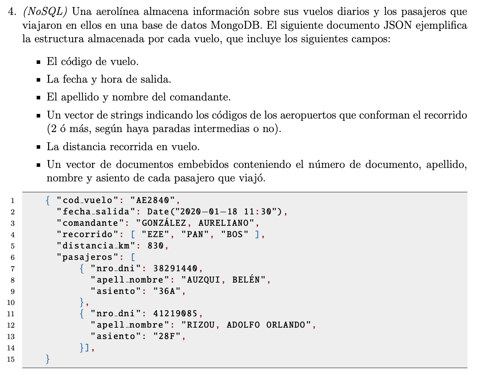
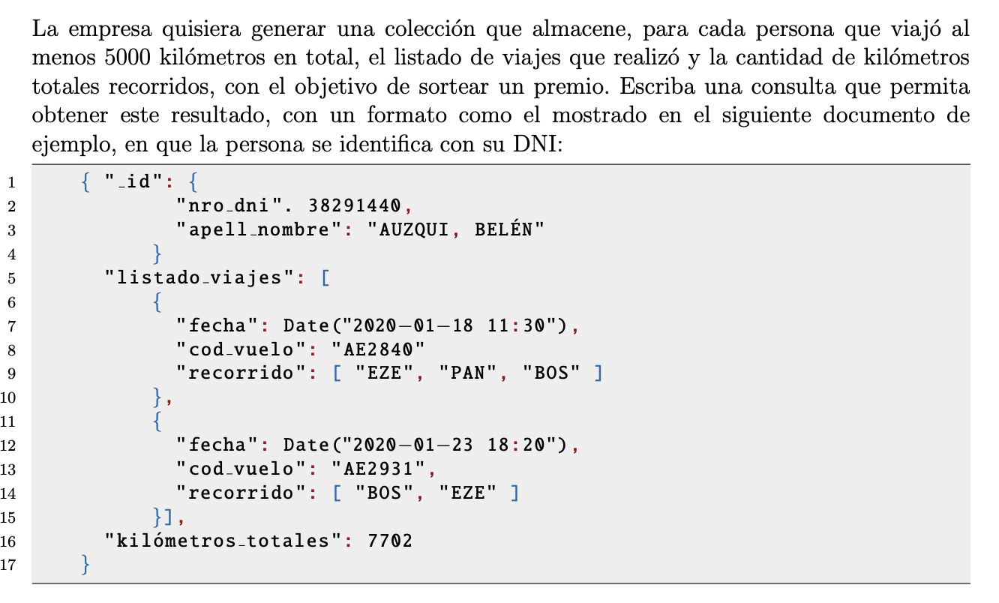
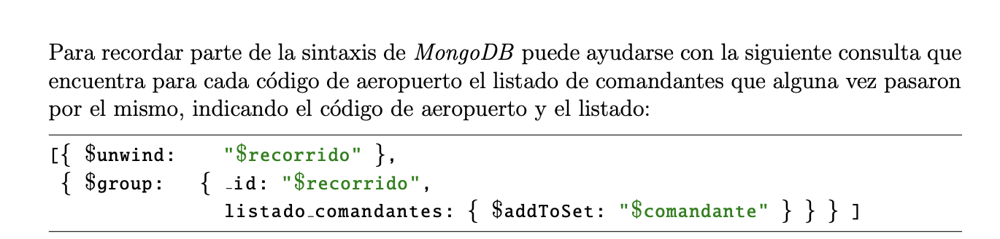
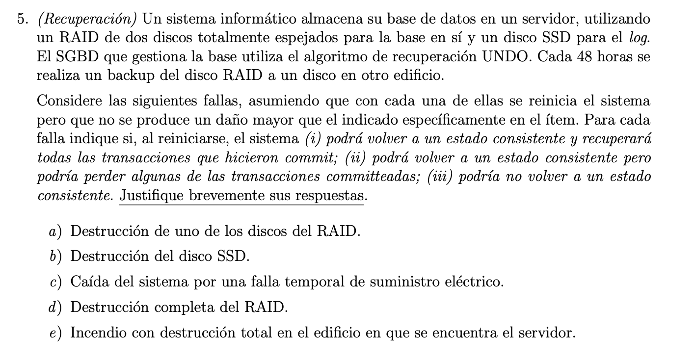
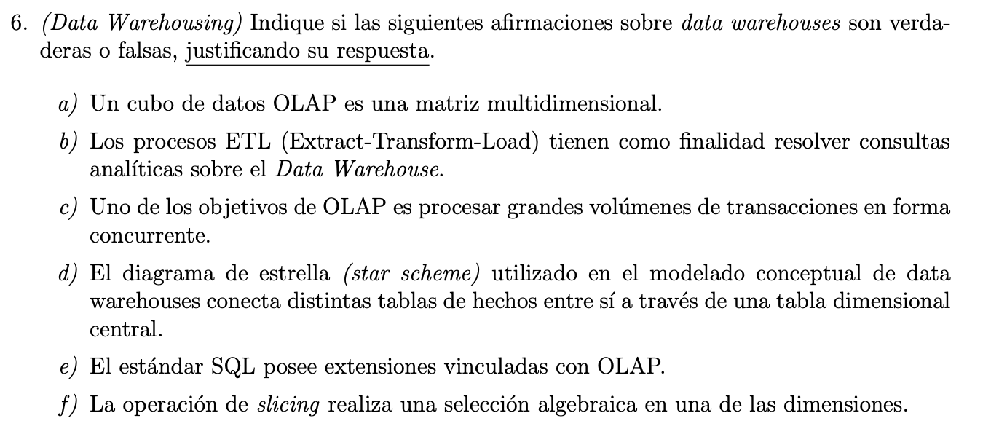

# Final 5-2-20

# Ejercicio 1

**Enunciado:**


**Solución**

**a)** Se queda con todos los nombres de las categorias(sin divididos). Hace una junta entre ganadores y categorias según el nombre de la categoría. Y luego se queda con el país y nombre de la categoría, de todos los países que hayan ganado en todas las categorías. 

**b)**
$$ 
{ g.pais, g.categoria| Ganadores(g) \land (\forall c) (\lnot Categorias(c) \lor (\exists g2) (Ganadores(g2) \land g2.nombre\_categoria = c.nombre \land g2.pais = g.pais) ))}
$$


# Ejercicio 2

**Enunciado:**




**Solución**

**a)** 

$$
cost(\pi_x(nro\_cliente)) = 2 B(ResúmenesImpagos) [log_{M-1}(B(ResúmenesImpagos))] -B(ResúmenesImpagos)
$$

$$
cost(\pi_x(nro\_cliente)) = 2 * 200000 [log_{2}200000)] -200000 = 6843856
$$

Por pipelining: 

$$
C(*) = 1000000 (Height(I(nro\_cliente, Clientes)) + 1) = 5000000
$$

El resultado total sería: 6843856 + 5000000.

**b)** 

Para la proyección: 

$$
n(\pi_x(nro\_cliente)) = n(ResumenesImpagos)
$$ 

Como dice en el a, si el atributo número de cliente solo representa el 10% de la tupla. La cantidad de tuplas que entra en un bloque aumenta. 

$$F(ResumenesImpagos) = \frac{n(ResumenesImpagos)}{B(resumenesImpagos)} = \frac{1000000}{200000} = 5 $$

Le pongo números ficticios para que la cuenta el razonamiento sea más fácil.

Si suponemos que cada tupla mide 80 bytes, con todos los campos. entonces cada bloque mide 5 * 80 bytes = 400 bytes. Ahora Si una tupla es el 10% de la original, entonces mide 8 bytes y entran en un bloque: 400/8 = 50. Por lo tanto el nuevo F(ResumenesImpagos) es 50. y el nuevo B(resumenesImpagos) es 20000.  

El resultado es un poco obvio, es el 10% de bloques que ocupaba antes :woman-face-palming:

Para la junta: 

(aunque no sé si esto se va a procesar o sólo se va a printear en pantalla)
$$
n(*) = \frac{n(ResumenesImpagos) n(Clientes)}{max(V(nro\_cliente, ResumenesImpagos), V(nro\_cliente, Clientes))}
$$

Luego con los datos del bloque se puede medir. 


**c)** 
Si disminuiría la base del logaritmo y daría un número más chico para ordenar. Habría que hacer el cálculo. 


# Ejercicio 3 

**Enunciado:**


**Solución**

# Ejercicio 4 

**Enunciado:**






**Solución**

```Mongodb

db.flights.aggregate([
   {
        $unwind: "$pasajeros"
    }, 
    {
        $group: {
            _id: {nro_dni: "$pasajeros.nro_dni", apell_nombre: "$pasajeros.apell_nombre"}, 
            kilometrosTotales:  { 
                $sum: "$distancia_km" 
            },
            listadoViajes: { 
                $addToSet: { fecha: "$fecha", cod_vuelo: "$cod_vuelo", recorrido: "$recorrido" }
            }
        }
    }, 
    {
        $match: {kilometrosTotales: { $gte: 5000}} 
    }
])

```


# Ejercicio 5

**Enunciado:**


**Solución**

TODO: completar


# Ejercicio 6

**Enunciado:**


**Solución**

Breve resumen: 
OLAP: Online analitical processing. 
OLTP: Oline transaction processing.

Al  querer incluir capacidades análisticas en SGB surge OLAP. 

OLAP cumple que:
- Vista conceptual multidimensional: Mantener los datos en una matriz donde cada dimensión representa un atributo
- Manipulación intuitiva de los datos. 
- Accesibilldad. 
- Extracción batch e interpretativa. 
- Modelos de análisis. 
- Arq. cliente servidor.

**Data warehouse**: copia paralela de las bases de datos principales de una organización donde se ejecutan las aplicaciones OLAP. 

**Modelo conceptual**: es la construcción de un sistema OLAP, el SGBD toma una instánea de la base de datos para construir un **modelo multidimensional de los mismos**. Los modelos conceptuales son estrella y copo de nieve. 

**Modelo dimensional**: define **medidas numéricas** sobre un **conjunto de atributos** que se definen como **dimensiones**. 

Durante el modelado conceptual de un DW se definien dichas dimensiones. 

**Hecho:** medida numérica asosciada a un valor concreto de cada una de las dimensiones. 

Cada **dimensión** tiene una serie de atributos asociados que pueden representarse con una relación. 

Los atributos de cada dimensión se pueden agrupar por **Jerarquías**. 

**Modelado lógico:**
La tabla de hechos guardará información sumarizada de acuerdo a las dimensiones que nos interesa guardar. 
    - MOLAP: multidimensional OLAP. Los datos agregados se almacenan en una base de datos multidimensional o **cubo de datos**. 
    - ROLAP: relational OLAP. la tabla de hechos agregada se almacena en una relación más. 
    - HOLAP: hybrid OLAP. Combuna el uso de un SGBD relacionar con un servidor MOLAP. 

**Operaciones OLAP**
- **rollup**: agrega datos de una dimensión, subiendo un nivel en la jerarquía de dimensiones. 
- **drillup**: mismo que antes pero baja. 
- **pivoteo**: produce una tabla agregada por un subconjunto del conjunto de dimensiones en cierto orden deseado. 
- **Slicig/dicing**: permiten realizar una selección en una dimensión (slice) o en más de una dimensión (dice).

El standar SQL nos define:
- GROUPING SETS, ROLLUP, CUBE, RANK, OVER. 

a) F. Cuando se define un modelado lógico del tipo MOLAP, los datos agregados se almacenan en ellos. No signigica que deba ser una matriz. (no estoy muy segura de esta)
b) F. Eso corresponde a OLTP. 
c) F. Es poder analaizar grandes volumenes de datos. Capacidad analíticca. reducir la cantidad de datos y expresar consultas más complejas. 
d) F. Une una tabla de hechos con distintas tablas dimensionales. 
e) V. Posee GROUPING SETS, ROLLUP, CUBE, RANK Y OVER. Algunos gestores como oracle, poseen otras instrucciones para determinar el refresco de las vistas, entre otras cosas. 
f) V. 