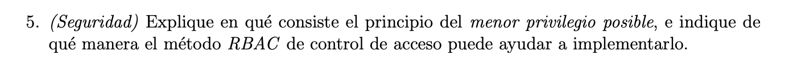
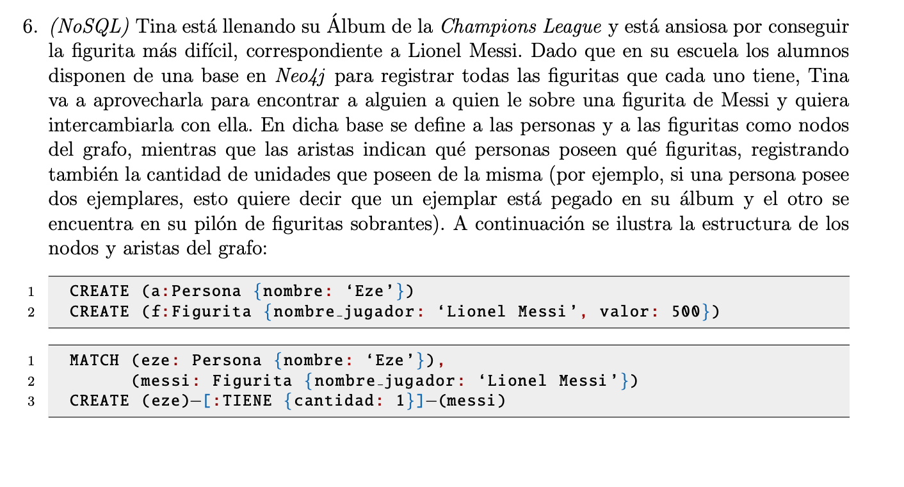
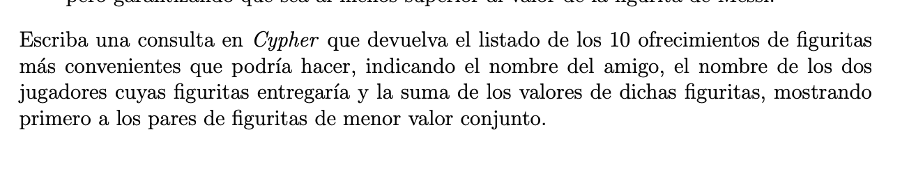
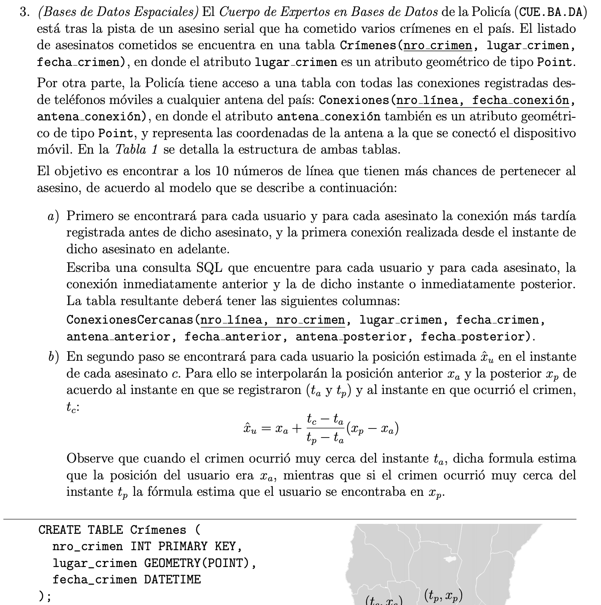

# Final 19-2-20

# Ejercicio 1

**Enunciado:**


**Solución**

```SQL

--- cantidad de votos por mes por nombre de programa
WITH aux1 as(
    SELECT mes, nombre_programa, count(*) as cantidad_votos
    FROM ProgramasFavoritos
    GROUP BY mes, nombre_programa
);

--- cantidad de votos maxima por mes

WITH aux2 as(
    SELECT mes, MAX(cantidad_votos) as max_cant_votos
    FROM aux1
    GROUP BY mes
);

SELECT nombre_programa, mes
FROM aux1 a1 INNER JOIN aux2 a2 ON (
    a1.mes = a2.mes AND
    a1.cantidad_votos = a2.max_cant_votos
)
```


**Solución**

# Ejercicio 3 

**Enunciado:**


**Solución**

# Ejercicio 4 

**Enunciado:**


**Solución**

# Ejercicio 5

**Enunciado:**


**Solución**

# Ejercicio 6

**Enunciado:**





**Solución**


# Bonus: GEO ESPACIALES



