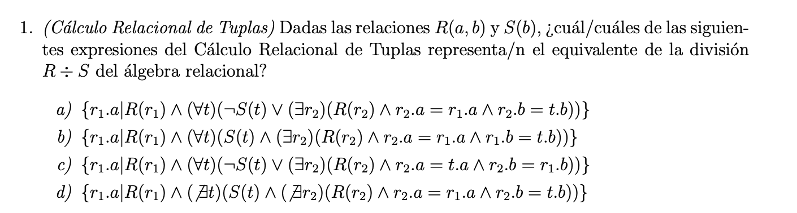
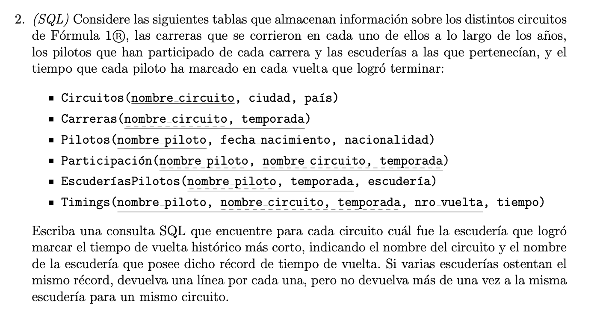
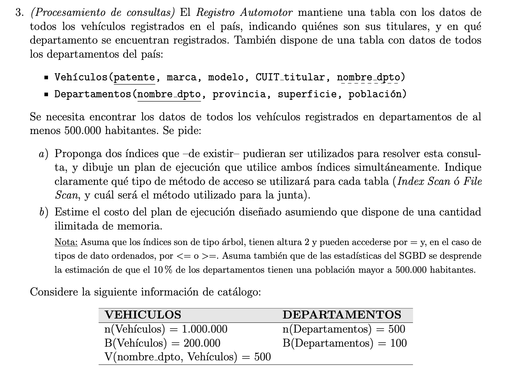
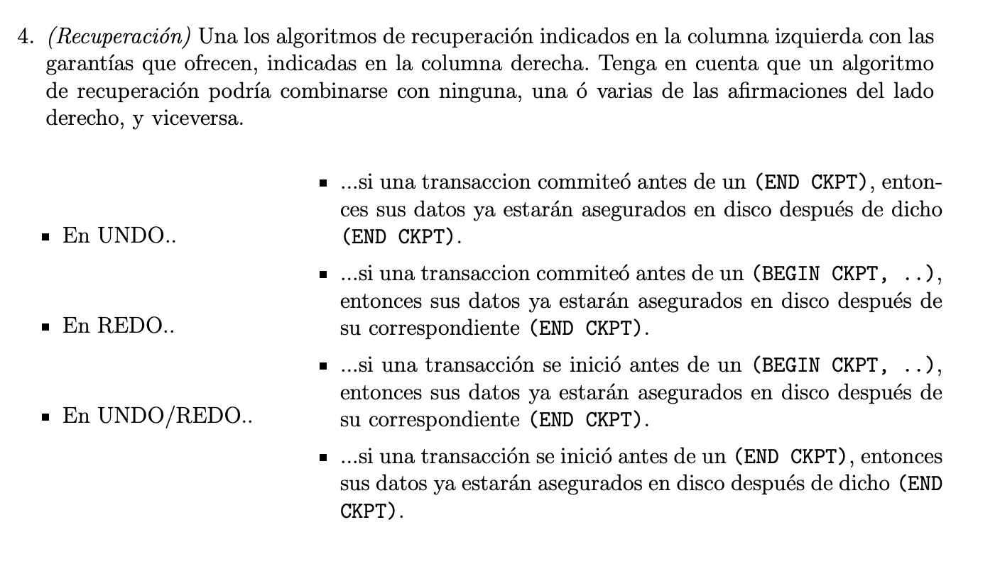
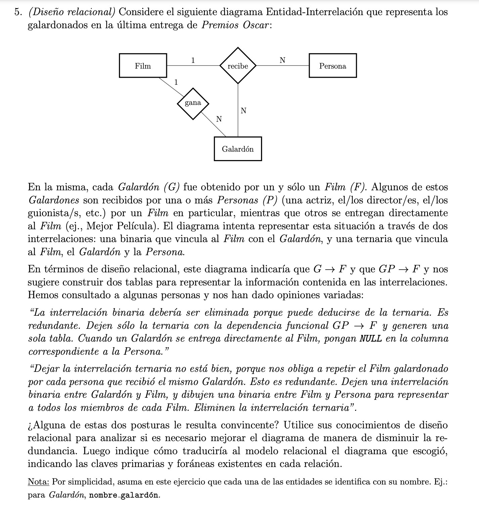
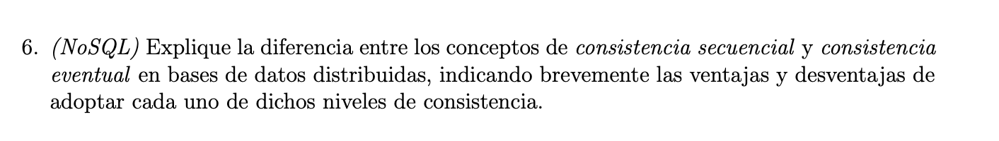

# Final 19-2-20

# Ejercicio 1

**Enunciado:**

**Solución**

Las tuplas que cumplen con la división equivalente en el cálculo relacional de tuplas son: la a y la d. 

Vemos que la b no puede ser porque el para todo t seguido de pertenece en S hace que evalue siempre a falso. 

Por otro lado, en el caso de c, vemos que no se cumple la condición de comparación correcta con r1. 

# Ejercicio 2

**Enunciado:**

**Solución**

# Ejercicio 3 

**Enunciado:**

**Solución**

# Ejercicio 4 

**Enunciado:**

**Solución**

# Ejercicio 5

**Enunciado:**

**Solución**

# Ejercicio 6

**Enunciado:**

**Solución**
