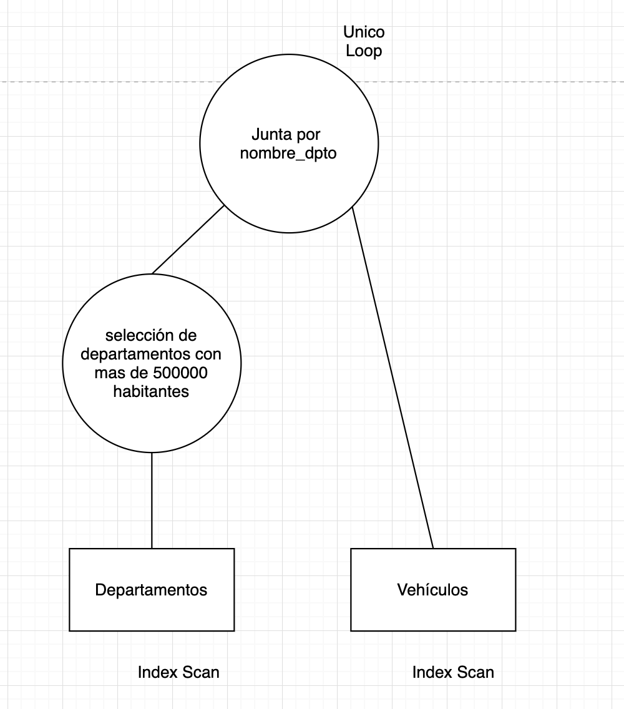

# Final 19-2-20

# Ejercicio 1

**Enunciado:**


**Solución**

Las tuplas que cumplen con la división equivalente en el cálculo relacional de tuplas son: la a y la d. 

Vemos que la b no puede ser porque el para todo t seguido de pertenece en S hace que evalue siempre a falso. 

Por otro lado, en el caso de c, vemos que no se cumple la condición de comparación correcta con r1. 

# Ejercicio 2

**Enunciado:**


```sql

--- tiempo más corto por circuito y escuderia

WITH aux1 AS(
    SELECT escuderia, nombre_circuito, MIN(tiempo) as tiempo_minimo
    FROM Timings INNER JOIN EscuderiasPiloto USING(nombre_piloto) as aux2
    GROUP BY escuderia, nombre_circuito
);

--- tiempo mínimo por circuito 

WITH aux2 AS(
    SELECT nombre_circuito, MIN(tiempo_minimo)
    FROM aux2
    GROUP BY nombre_circuito;
);

SELECT escuderia, nombre_circuito
FROM aux1 a1 INNER JOIN aux2 a2 ON (
    a1.nombre_circuito = a2.nombre_circuito AND 
    a1.tiempo_minio = a2.tiempo_minimo
)

```

**Solución**

# Ejercicio 3 

**Enunciado:**


**Solución**

La solución propuesta es la siguiente: 



Supongo que existen dos índices. Uno de tipo clustering para los veículos y otro de tipo clustering para los departamento. 

- $I(poblacion, Departamentos)$
- $I(nombre\_dept, Vehículos)$

El costo de la selección es: 

$$
C(\sigma_{poblacion\ge 500000} Departamentos) \\ = Height(I(poblacion, Departamentos) + \frac{B(Poblacion)}{V(poblacion,Departamentos)}) \\ = 2 + \frac{100}{50} = 4
$$

El costo de la junta es: 
$$
C(\Join) = B(Departamentos) + n(Departamentos)\\ 
(Height(I(nombre\_dpto, Vehículos))+ \frac{B(Vehículos)}{V(nombre\_dpto,Vehículos)}) = \\
100 + 500 (2 + \frac{200000}{500}) = 21000
$$

El costo total es de 4 + 21000

Si se tiene ilimitada memoria se puede usar como union junta hash mejorando el resultado. Adicionalemente se puede mantener el resultado de la selección en memoria y ahorrarnos 100 en la junta. 
# Ejercicio 4 

**Enunciado:**


**Solución**

El UNDO cumple la primera.

El REDO/UNDO-REDO cumple la segunda.

El UNDO/UNDO-REDO cumple la tercera.

Creo que la cuarta no la cumple nadie.

# Ejercicio 5

**Enunciado:**


**Solución**

TODO

# Ejercicio 6

**Enunciado:**

**Solución**

TODO
