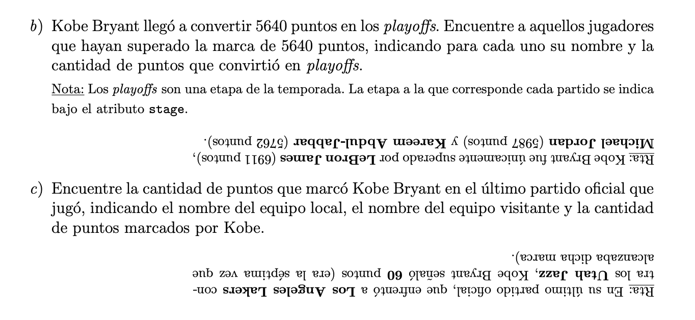

# Final 5-2-20

Magali Marijuan

# Ejercicio 1

**Enunciado:**




**Solución**

a) 

```sql

-- equipos en los que jugo por temporada --
WITH AUX1 as(
    SELECT team_name, season_name
    FROM TeamsCompositions 
    WHERE player_name like 'KOBE BRYANT'
);

-- partidos que jugo --

WITH AUX2 as(
    SELECT m.match_id
    FROM AUX1 as a1 INNER JOIN Matches as m ON (
        (a1.team_name = local_team OR a1.team_name = visiting_team) AND
        a1.season_name = m.season_name
    ) as aux2 
);

-- SOLUCIÓN --
SELECT points
FROM Actions INNER JOIN AUX2 using(match_id) as aux3
WHERE player_name LIKE 'KOBE BRYANT' and points >= 50
```

b) 

```SQL

-- partidos de playoff --
WITH AUX1 as(
    SELECT match_id
    FROM Matches
    WHERE stage_name LIKE "playoffs"
);


-- SOLUCIÓN

SELECT player_name, total_play_off_points
FROM (
    SELECT player_name, SUM(points) as total_play_off_points
    FROM Matches INNER JOIN AUX1 USING(match_id)
    GROUP BY player_name
) as AUX2
WHERE total_play_off_points >= 5640

-- o si no

SELECT player_name, SUM(points) as total_play_off_points
FROM Matches INNER JOIN AUX1 USING(match_id)
GROUP BY player_name
HAVING SUM(points)>= 5640

```

c) 
```SQL

-- equipos en los que jugó --
WITH AUX1 as(
    SELECT team_name, season_name
    FROM TeamsCompositions 
    WHERE player_name like 'KOBE BRYANT'
);

-- ultimo partido que jugó
WITH AUX2 AS (
    SELECT match_id, local_team, visiting_team, max(date)
    FROM Matches INNER JOIN AUX1 (
        (a1.team_name = local_team OR a1.team_name = visiting_team) AND
        a1.season_name = m.season_name
    )
);

-- SOLUCIÓN
SELECT local_team, visiting_team, points
FROM Actions INNER JOIN AUX2 USING(match_id)
WHERE player_team like 'KOBE BRYANT' 

```


# Ejercicio 2

**Enunciado:**


**Solución**

a) Toma `Productos` y `Precios` y hace la junta por el campo `cod_barras`. Se queda todas las tuplas cuya categoría sea `Frescos`  Y se queda con el atributo `nombre_super` de cada tupla (eliminando repetidos). Luego a supermercados le quita todos los supermercados que resultaron de tener la categoría frescos y se queda con los nombres de esos super. 

En fin, se queda con todos lo supermercados que no vendan `Frescos`

b) Renombra la relación `Precios` como `p2`. Renombra la relación `Precios` como `p1`. Hace la Junta entre `p1` y `p1`siempre que el código de barra de cada tupla de `p1` sea igual a la tupla de `p2`y el precio de `p1` sea menor que el precio de `p2`. Del resultado se queda con el atributo `nombre_super`sacando repetidos y se los resta a `Supermercados`quedandose nuevamente con los nombres de los supers. 

En fin, se queda con todos los uspermercados que vendan algún producto al menor precio. 


c) Se queda todas las categorías (sin repetidos). Toma `Productos` y `Precios` y hace la junta por el campo `cod_barras`. Se queda con el `nombre_super` y `categoria` de todos los supers que vendan en todas las categorías.

# Ejercicio 3 

**Enunciado:**


**Solución**

a) 

*Utilizo unico loop*


$$
C(\Join_{nro\_pasaporte}) = B(LISTADO) + n(LISTADO) (Height(nro\_pasaporte, COMPOSICIONES) + \frac{n(COMPOSICIONES)}{V(nro\_pasaporte, COMPOSICIONES)})
$$

$$
C(\Join_{nro\_pasaporte}) = 20 + 200 (4 + \frac{300M}{100M}) = 1420
$$
 
No contabilizo el costo de $C(\sigma_{(aerop.orig = 'WUH') OR aerop.dest = 'WUH')})$ por pipelining con la junta siguiente. 

*Utilizo Junta Hash -> porque se cuenta con limitada memoria*


$$
C(\Join_{cod_vuelo}) = 3 (C(\Join_{nro\_pasaporte})  + C(\sigma_{(aerop.orig = 'WUH') OR aerop.dest = 'WUH')}) = 3 (C(\Join_{nro\_pasaporte}) + B(VUELOS) ) = 1420 + 1000
$$


**b)** El costo sería menor porque el costo de index_scan con idx de clustering sería: 

$$
C(t1) = Height(nro\_pasaporte, COMPOSICIONES) + \frac{B(COMPOSICIONES)}{V(nro\_pasaporte, COMPOSICIONES)} = 4 + (30M / 100M) = 4.3 
$$

Que es menor a 7, lo que habíamos obtenido antes. Esto es porque al ser de clustering los datos en la tabla están ordenados bajo este índice y se puede implementar alguna lógica para traer los bloques que sólo están compuestos (casi todos) por el número de pasaporte buscado. Hay que considerar que los índices de clustering son más costoso de mantener, porque cada vez que se da una inserción hay que ordenar.

**c)** No, porque para hacer la selección se require ver todas las tuplas y por lo tanto, traer todos lo bloques de memoria. Podría, incluso, ser más costos, ya que involucra traer los bloques del index tree. 


# Ejercicio 4 

**Enunciado:**


**Solución**

Suponiendo que estamos resolviendo bajo serializabilidad del tipo **por conflicto**.

Para implementar un **control basado en locks** y asegurar la serializabilidad es importante implementar el **protocolo de dos fases**. Estos nos dice que cada transancción debe tomar todos locks (siguiendo un orden asignado a los items) al comienzo de la transacción y liberarlos al final. 

Para evitar problemas de **deadlock e inanición**: 
- Adquirir todos los locks al principio
- Establecer un órden de los items (podría estar basdo en time stamp) 
- Definir un grafo de alocación de recursos y timeout para adquisición de lock. 
- Encolar los pedidos de locks de manera tal que las transacciones que esperan de hace más tiempo por un recurso tengan prioridad en la adquisición dle lock. 

 T1 | T2 
--- | --- 
b   |
$R_{T1}(A)$|
  - | b
  - | $R_{T2}(A)$
  - | $R_{T2}(B)$
$W_{T1}(A)$|
$R_{T2}(B)$|
 -  | $W_{T2}(B)$  
 c  |  
 -  | c

Vemos que hay un conflicto de T2 -> T1 porque ($R_{T2}(A)$, $W_{T1}(A)$) y de T1 -> T2  porque ($R_{T2}(B)$, $W_{T2}(B$)).

Si implementamos el protocolo de dos fases:

- Definimos que el orden para requerir locks sea primero el de A y luego el de B. 

 T1 | T2 
--- | --- 
b   |
$LOCK_{T1}(A)$| 
$LOCK_{T1}(B)$| 
$R_{T1}(A)$|
$W_{T1}(A)$|
$R_{T2}(B)$|
$UNLOCK_{T1}(A)$| 
$UNLOCK_{T1}(B)$|  
 c  |
  - | b
  - |$LOCK_{T2}(A)$ 
  - |$LOCK_{T2}(B)$
  - | $R_{T2}(A)$
  - | $R_{T2}(B)$
 -  | $W_{T2}(B)$ 
  - |$UNLOCK_{T2}(A)$ 
  - |$UNLOCK_{T2}(B)$
 -  | c


# Ejercicio 5

**Enunciado:**


**Solución**

Como en la línea 14 se encuentra con un END CKPT debe retroceder al BEGIN de la transacción activa más antigua definida en la linea 7, que es T2. 

Rehacer el write de la línea 4, 5. 
Rehacer el write de la línea 10 y 12. 

Abortar T4 y volcar el log a disco. 


# Ejercicio 6

**Enunciado:**

**Solución**


TODO: completar mañana